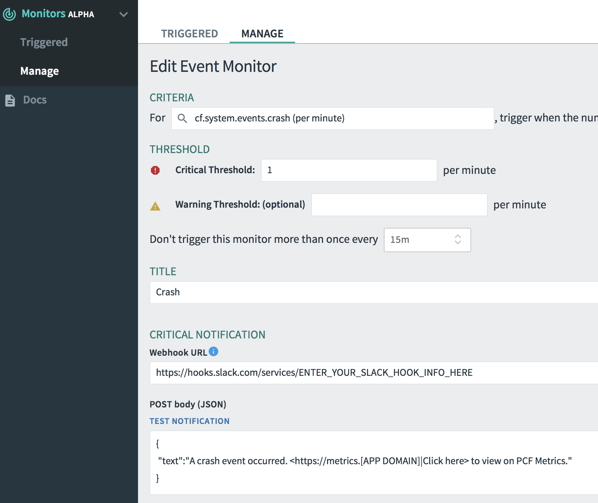
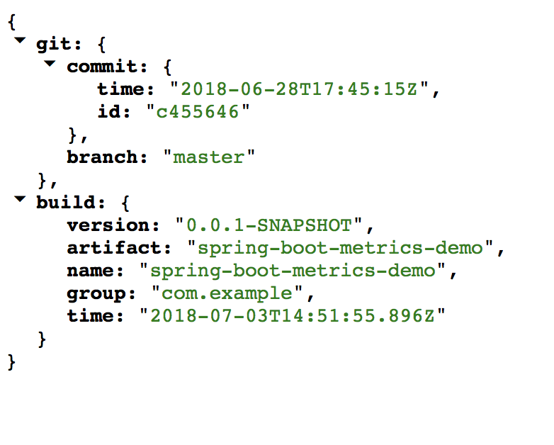

# Spring Boot with PCF Metrics Demo

Application demonstrating Logging, Metrics, Tracing, Monitoring, and Alerting functionality with Spring Boot 2.0 (with Micrometer) and functionality of the "PCF Metrics" Tile in Pivotal Cloud Foundry.

Centralized logging / metrics / and logging functionality is provided out-the-box with the PCF platform with a default storage time of 2 weeks.

Third-party platform ingestion (i.e. Splunk, Datadog, Promethus) can be added as well for more advanced use-cases.

## Demo Steps

### 1. Deploy to PCF

Build the application (via Gradle)

```sh
./gradlew
```

or build the application (via Maven)
```sh
./mvnw package
```

Deploy to PCF using the CLI (for gradle build)

```sh
cf push
```

Deploy to PCF using the CLI (for maven build)

```sh
cf push -p target/spring-boot-metrics-demo-1.0.0-SNAPSHOT.jar
```


> Use --no-route in case of conflicting routes.

### 2. Enable Metrics forwarding to PCF Metrics 

#### 2.a (PCF 2.4 or greater )

##### Add the Prometheus Micrometer dependency to your build script

Add the io.micrometer:micrometer-registry-prometheus dependency to either your pom.xml or gradle.build file:

Gradle: 
```groovy
    compile('io.micrometer:micrometer-registry-prometheus')
```

Maven:
```xml
    <dependency>
        <groupId>io.micrometer</groupId>
        <artifactId>micrometer-registry-prometheus</artifactId>
    </dependency>
```

##### Ensure Metric Registrar CLI plugin is installed

```sh
    cf install-plugin -r CF-Community "metric-registrar"
```

##### Build and Deploy your Application 

```sh
    gradle build && cf push APP-NAME
```

Remember to replace APP-NAME with your application name. 

##### Register your Metrics endpoint with PCF

```sh
    cf register-metrics-endpoint APP-NAME /actuator/prometheus
``` 

Remember to replace APP-NAME with your application name. 

 
#### 2.b (PCF 2.3 or earlier )

Create and Bind the Forwarder Service -- 

This is required for Custom Application Metrics.

##### Ensure *Metric Forwarder* service is available in the CF MarketPlace

```sh
cf marketplace
```

Contact your PCF Cloud Ops team if it is not.

##### Create the Service

You can use a *plan* and *name* of your choice.

```sh
cf create-service metrics-forwarder unlimited myforwarder
```

##### Bind the Service to your Application

```sh
cf bind-service metrics-demo myforwarder
```

##### Restage your Application

```sh
cf restage metrics-demo
```

### 3. Create a Slack Incoming WebHook URL

Required for Alerting Functionality.

One can be created by logging into your Slack account at www.slack.com, browsing the *App Directory* for *Incoming WebHooks* and adding your own configuration. 

(App Directory Link is available on home page footer of Slack under Resources).


You should then be able to send Slack messages to yourself by *posting* to that URL.

Example: (note INSERT_YOUR_WEB_HOOK_URL -- update this with your generated "Webhook URL")

```sh
curl -s -d "payload={\"text\":\"Test Message\"}" INSERT_YOUR_WEB_HOOK_URL_HERE
```

To demo the Application Error Level Log Alerting with deployed PCF apps, make sure your PCF app instance has the *SLACK_INCOMING_WEB_HOOK* environment variable set to your URL.

To add this value using the CLI (update INSERT_YOUR_WEB_HOOK_URL_HERE accordingly)

```sh
cf set-env metrics-demo SLACK_INCOMING_WEB_HOOK INSERT_YOUR_WEB_HOOK_URL_HERE
```

You will need to re-stage after this .. 

For local testing you will need to set your SLACK_INCOMING_WEB_HOOK environment variable accordingly. 

```sh
export SLACK_INCOMING_WEB_HOOK=https://hooks.slack.com/services/SOME_CORRECT_VALUE

```

### 4. Demo the functionality

Functionality is available from the default application path ( i.e. the application index page ). 

#### Metrics

Demo Application Metrics including the built-in ones listed with the /actuator/metrics endpoint. As well as the custom ones used in the MetricsController.

Demo creation of Chart in PCF Metrics using custom application data.


#### PCF Metrics - Alerting

*Required PCF Metrics 1.5!!*

Create a PCF Metric Alert under the Monitor Tab -- use the build in crash event.

Demo Slack PCF Metrics Alerting, by simulating a JVM crash (button).



PCF Metrics Event alerting lag may talk up to a few minutes.

#### Trace

Discuss the value of "Correlation IDs" , especially with regards to MicroService designs.

Invoke a traced calling -- via provided web gui. 

Locate it in the PCF Metrics Log view, and view it in the Trace Explorer.


PCF Metrics Trace ingestion may take up to a few minutes.

Note that Logs will be aggregated across Applications as well (assuming shared TraceId).


#### Logging

Demo Logging in PCF Metrics.

Also demo CLI access to centralized logging.

```sh
cf logs APP_NAME
```

#### Logging - Alert

Note SLACK_INCOMING_WEB_HOOK environment variable needs to be set -- either in PCF or locally.

> TIP - Add Logging Error Level Alerts to your Applications for quick notification of Application Issues and reduction in *Mean-Time-to-Repair* (MTTR).

##### Server-Side (JVM)

Demo Server-Side Alerting (JVM), by causing a Server-Side Application Error / Exception (button).

##### Client-Side (JS)

Demo Client-Side Alerting (JS), by causing a Client-Side Error / Exception (button).

Note that we are persisting the UserAgent -- important in helping isolate "page-snap" issues.

#### Application Information

Demo the /actuator/info endpoint.  Note the inclusion of Git and Build information to easily identify deployed artifact.



Note that custom /info and /health information can easily be added in a variety of ways.

### Demo Notes

#### Exposed Actuator Endpoints

Note that most actuator endpoints are restricted / locked down by default , hence the change in the *application.properties* file to expose all of them (not recommended in production)

```properties
management.endpoints.web.exposure.include=*
```
#### Logfile Actuator Endpoint Requirements

For the logfile endpoint to be enabled, to application needs to be configured to save logs to a local flat file (not a default).

#### VCAP environment variable usage in logback.xml

Note the VCAP environment variable usage in logback.xml to include PCF information in Slack Alerts.

#### Custom CONSOLE_LOG_PATTERN in logback.xml

For Log messages to correlate to Trace / Span Id's,  these 2 pieces of information need to be included in log entries.

#### Route usage (in TraceController) via VCAP variables

For demo purposes, the Demo is calling itself (via app route) , use of localhost:8080 will prevent Tracing Information from showing up as it's captured at the route request level.

#### WebClient Bean Annotation

WebClient needs to be annotated with Bean annotation for Spring Cloud Sleuth to correctly "hook in" and inject Trace information.

#### Tracing Spring Cloud Sleuth Requirements

The org.springframework.cloud:spring-cloud-starter-sleuth dependency is required for injection of required Tracing information.

#### Metrics Label / Tag Cardinality 

High cardinality label / tag values (i.e. unique guids, user data such as emails, etc) for metrics implementations are highly discouraged, and have the potential to overwhelm time-series databases such as Datadog or Promethues. 

### Humio Metrics Integration Notes 

As an alternate target for Metrics, you can also use alternate Metrics Platform Solutions. One such / easy to setup solution is Humio.

Setup a Free Humio Cloud account at : https://humio.com

Add the Humio Micrometer registry to your build dependencies. 

```gradle
    compile('io.micrometer:micrometer-registry-humio:latest.release')
```

In your sandbox repo settings, create and get an Ingest Token. 

Update your application properties with the Humio ingest token:

```properties
    management.metrics.export.humio.api-token=YOUR_TOKEN
```


Sample Humio Queries: 

Timechart example:

__name=purchase | timechart(function=avg(sum))__

Timechart example split by product_name (label / tag):

__name=purchase | timechart(product_name, function=avg(sum))__
